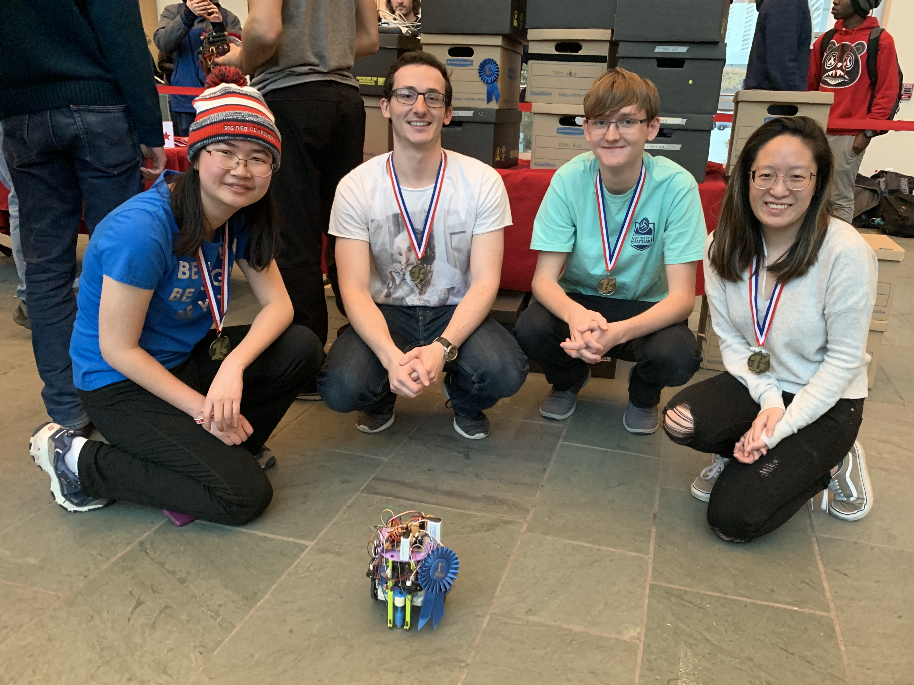

# Introduction

A photo of the winning team with our robot! Back row (from left to right): Jinny Gui, Daniel Buscaglia, Ryan McMahon, Joy Thean. Front Row: Axel.

Below is a video showing our robot competing in the third and last round of 
the robot competition on 12/10/19.

  <iframe width="560" height="315" src="https://www.youtube.com/embed/WHWdpXG5ZM4" frameborder="0" allow="accelerometer; autoplay; encrypted-media; gyroscope; picture-in-picture" allowfullscreen></iframe>

[Team Contract](https://drive.google.com/file/d/1-kGICPlhbmg0IWlSnd9KlUpACal9PjoH/view?usp=sharing)

# Labs
[Lab 1](labs/lab1.md)

[Lab 2](labs/lab2.md)

[Lab 3](labs/lab3.md)

[Lab 4](labs/lab4.md)

# Milestones

[Milestone 1](milestones/milestone1.md)

[Milestone 2](milestones/milestone2.md)

[Milestone 3](milestones/milestone3.md)

[Milestone 4](milestones/milestone4.md)

# Meet the Team

