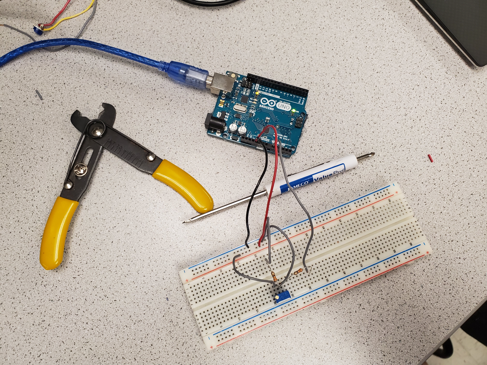
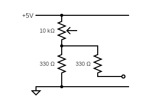
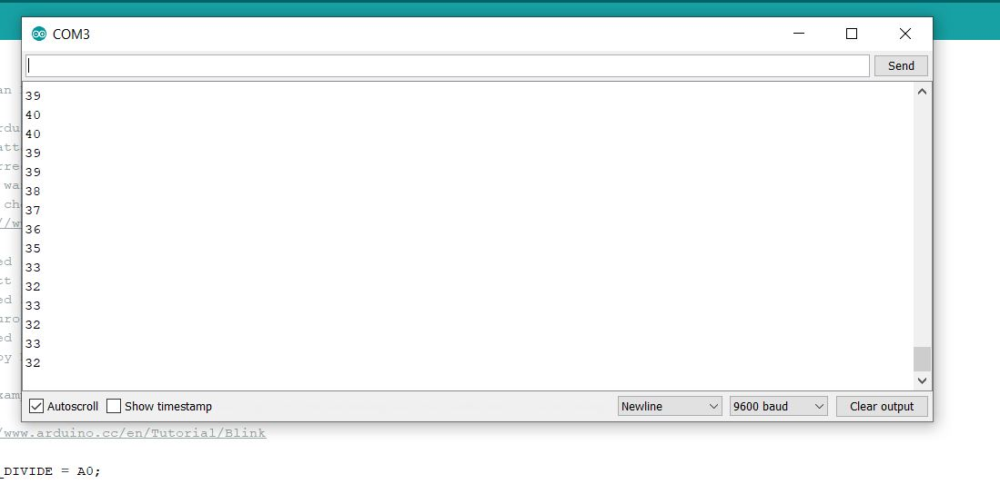

# Lab 1: Microcontroller

## Overview
The goal of Lab 1 was to accustom us to the many functionalities of the Arduino UNO 
and the Arduino IDE, such as using analog and digital input/outputs and driving 
peripheral devices (LED, Servos, etc). The finished product was to create 
an assembled robot that drives autonomously.

### Materials
* 1 Arduino Uno
* 1 USB A/B Cable
* 1 Continuous rotation servos
* 1 Pushbutton
* 1 LED (red)
* 1 Potentiometer
* Several resistors (kΩ range)
* 1 Solderless breadboard

## Using and Modifying the Blink Sketch

The first task was to use the provided Blink example code to light up an internal LED for 1 second 
and turn it off for 1 second, looping repeatedly. A video is displayed below showing the results.

<iframe width="560" height="315" src="https://www.youtube.com/embed/ZpkMIolsPc0" frameborder="0" allow="accelerometer; autoplay; encrypted-media; gyroscope; picture-in-picture" allowfullscreen></iframe>

Next, we took the Blink sketch and modified it to light up an external red LED.
To do this, we placed a red LED on the breadboard, wired it through a 330Ω resistor to limit the current through the LED,
and connected it to an output pin on the Arduino. We also changed the setup function. 
The final code is displayed below, along with a video showing the results.

```c
// A simple Arduino program to make an external LED blink

int EXTERNAL_LED = 13;
// the setup function runs once when you press reset or power the board
void setup() {
  // initialize digital pin LED_BUILTIN as an output.
  pinMode(EXTERNAL_LED, OUTPUT);
}

// the loop function runs over and over again forever
void loop() {
  digitalWrite(EXTERNAL_LED, HIGH);   // turn the LED on (HIGH is the voltage level)
  delay(1000);                       // wait for a second
  digitalWrite(EXTERNAL_LED, LOW);    // turn the LED off by making the voltage LOW
  delay(1000);                       // wait for a second
}
```

<iframe width="560" height="315" src="https://www.youtube.com/embed/X57n8F3q364" frameborder="0" allow="accelerometer; autoplay; encrypted-media; gyroscope; picture-in-picture" allowfullscreen></iframe>

## Reading from a Potentiometer

In the second section of the lab, we were tasked with using a potentiometer to figure out 
how to operate the analog input ports of the Arduino. We first wired up the potentiometer 
as shown in the following picture: power to 5V, ground to ground, and the output signal 
through a parallel combination of 330Ω resistors. The resistor that connects to ground 
acts as the other half of a voltage divider, while the resistor that connects to an 
analog input port on the Arduino board acts as a current limiter. A simple schematic 
is shown below. 





We then tested the output readings through serial communication. A snippet of the output 
stream printed to COM3 as we turned the potentiometer is shown below, as is the code we 
used to read the voltage level.




```c
// This program allows us to continuous read the voltage 
// across a voltage divider by alternating the potentiometer

int VOLT_DIVIDE = A0;

// the setup function runs once when you press reset or power the board
void setup() {
  // initialize digital pin VOLT_DIVIDE as an output.
  pinMode(VOLT_DIVIDE, INPUT);
  Serial.begin(9600);
}

// the loop function runs over and over again forever
void loop() {
  Serial.println(analogRead(VOLT_DIVIDE));    // Print out the value being read from the analog pin
  delay(500);                                 // wait for half a second
}
```

We were also tasked with adjusting the brightness of an LED with the potentiometer.
To do this, we left our potentiometer on the board as it was in the previous section. We then
wired a red LED to digital output 3 through a 330Ω resistor. We selected output 3 because it has pulse width modulation
capabilities, which we need to vary the brightness of the LED as we turn the potentiometer. 
Finally, we modified the code from the previous section so that we now write to port 3 
based on the voltage reading. We divided the voltage by 2 and wrote that value to the 
LED because based on some experimenting, that mapping produced the greatest change in 
brightness as the potentiometer was turned.
A clip of the results are shown below, along with the modified code that was used.

<iframe width="560" height="315" src="https://www.youtube.com/embed/P90ZEs6cvP0" frameborder="0" allow="accelerometer; autoplay; encrypted-media; gyroscope; picture-in-picture" allowfullscreen></iframe>

```c
// This program allows us to control the brightness of an LED by turning the potentiometer

int VOLT_DIVIDE = A5;
int LED = 3;
int v = 0;

// the setup function runs once when you press reset or power the board
void setup() {
  // initialize digital pin LED_BUILTIN as an output.
  pinMode(VOLT_DIVIDE, INPUT);
  pinMode(LED, OUTPUT);
}

// the loop function runs over and over again forever
void loop() {
  v = analogRead(VOLT_DIVIDE);
  analogWrite(LED, v/2);
}
```
## Driving A Servo
In this next portion of the lab, we were tasked with driving a servo using the Arduino UNO.
The servos will be the driving the wheels of our robot later on.

For our first task, we wired a servo up to the Arduino as follows: power to 5V, ground to ground, 
and input of the servo through a 330Ω resistor to a PWM-capable digital output on the Arduino. 
We then played with some values to send from the Arduino to the servo to see how it works. We 
found that from 0-80 and from 100-180, the servo was at roughly the same speed (but in opposite 
directions for the two ranges), and that from 80-100, each value noticeably altered the speed 
of the servo. Finally, we created a for loop to sweep the full range of values to the servo. 
The results of this sweep, as well as the code used, are shown below.

<iframe width="560" height="315" src="https://www.youtube.com/embed/WLWtf4ng6Ug" frameborder="0" allow="accelerometer; autoplay; encrypted-media; gyroscope; picture-in-picture" allowfullscreen></iframe>

```c
// We used this program to experiment with how the Servo motor rotates to figure out how it functions

#include <Servo.h>

Servo SERVO;

void setup() {
  // put your setup code here, to run once:
  SERVO.attach(3);
}

void loop() {
  // put your main code here, to run repeatedly:
  for (int pos = 180; pos >=0; pos -=1) { // to sweep the voltage, found on Arduino Servo Library
    SERVO.write(pos);
    delay(40);
  }
}
```

After testing the servo alone, we used a potentiometer to adjust the speed and direction 
at which the servo motor was rotating. We wired up the potentiometer up exactly as it was 
in the previous section. We also took our code from the previous section that was used to 
change the LED's brightness using the potentiometer and modified it slightly. We chose to 
multiply the voltage by 2 and write that value since the Arduino read voltages in the 
30-60 range. Thus, doubling the voltage would put us in the 60-120 range, enabling the 
servo to rotate in both directions. A clip of the results are shown below, along with 
the modified code that was used.


<iframe width="560" height="315" src="https://www.youtube.com/embed/ou17E-c4ugQ" frameborder="0" allow="accelerometer; autoplay; encrypted-media; gyroscope; picture-in-picture" allowfullscreen></iframe>

```c
// This program allows us to control the rate at which 
// the Servo rotates by twisting the potentiometer

#include <Servo.h>

Servo SERVO;
int VOLT_DIVIDE = A5;
int v = 0;

void setup() {
  // put your setup code here, to run once:
  SERVO.attach(3);
  pinMode(VOLT_DIVIDE, INPUT);
}

void loop() {
  // put your main code here, to run repeatedly:
  v = analogRead(VOLT_DIVIDE);
  SERVO.write(v*2);
}
```

## Driving Autonomously
The last task in this lab was to build a robot that drives autonomously. We had to determine the correct servo speeds
to have the robot make 90 degree left and right turns that followed a grid. We ultimately decided to have it drive
in a figure eight. The code and video are shown below.

<iframe width="560" height="315" src="https://www.youtube.com/embed/kf4MASRxF84" frameborder="0" allow="accelerometer; autoplay; encrypted-media; gyroscope; picture-in-picture" allowfullscreen></iframe>

```c
// This program will eventually allow the robot to autonomously move in a figure eight

#include <Servo.h>

Servo right;
Servo left;

int right_pin = 11;
int left_pin = 10;

void leftTurn(int t) {
  left.write(0);
  right.write(60);
  delay(t);
}

void rightTurn(int t) {
  left.write(120);
  right.write(180);
  delay(t);
}

void moveForward(int t) {
  left.write(180);
  right.write(0);
  delay(t);
}

void rightSquare() {
  for (int i = 0; i < 4; i++) {
    moveForward(3000);
    rightTurn(670);
  }
}

void leftSquare() {
  for (int i = 0; i < 4; i++) {
    moveForward(3000);
    leftTurn(670);
  }
}

void figureEight() {
  for (int i = 0; i < 4; i++) {
    moveForward(3000);
    leftTurn(668);
  }

  for (int i = 0; i < 4; i++) {
    moveForward(3000);
```
