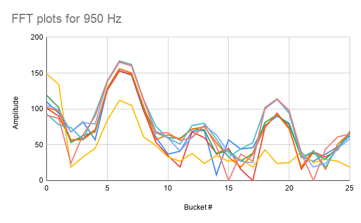
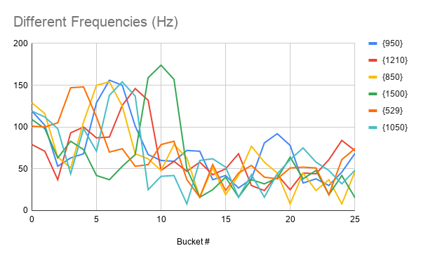

# Lab 2: Analog & Digital Circuitry and FFTs

## Overview
The goal of Lab 2 was to be able to detect a 950 Hz note using the FFT algorithm.
In order to do this, we designed an amplifying band pass circuit to take the output
of an electret microphone and boost the signal while blocking undesired frequencies.
This signal is then sent into the Arduino, where the FFT algorithm looks to find the right
frequency. At that point, our robot is to begin moving. In addition, we also designed a
Schmitt Trigger circuit to be used in our wall detection. We wire the output of an IR sensor
to the trigger, and it completely converts the analog signal into a digital one, thus freeing
up some analog ports for future use. In working on this lab, we broke up into two subteams:
Jinny and Ryan worked on the FFT algorithm and analysis, while Joy and Dan worked on designing
and building the circuitry for both the band pass amplifier and the Schmitt Trigger.

### Materials
* 1 Arduino Uno
* 1 USB A/B Cable
* Electret Microphone
* Multiple Capacitors (nF and uF range)
* Several Resistors (kΩ range)
* LM358P Operation Amplifiers
* Oscilloscope
* DC Power Supply
* Digital Multimeter
* Frequency Generator App for Cell Phone

## Amplifying Band Pass Circuit

The first part of this lab involved building a circuit for the electret microphone. A picture of a microphone along with a representative circuit schematic are shown below. The pull-up resistor is required to help bias the FET and power the microphone, while the capacitor blocks DC signals from the microphone.

<p align="center">
  
  
</p>

The first consideration when designing the circuit was to amplify the output of the microphone. The output voltage
was so small that nothing registered on the oscilloscope except when we would tap the microphone with our fingers.
Thus, we would need a very large gain, so we decided to design an inverting amplifier, carefully
selecting the resistors as to generate a huge gain. In addition to the huge gain, we also wanted to be able to
lower the gain of undesired frequencies; after all, the end goal is to detect a 950 Hz signal and other frequencies
could trigger false positives. Thus, we converted our inverting amplifier into a second order band pass filter. We
carefully selected the capacitor values (and modified the resistor values) so that the break frequencies were around
550 Hz and 1050 Hz. While the lower break frequency is a little low, we didn't have the components to make a working
filter that had a pass band that was so narrow. However, 550 Hz is high enough to drown out plenty of background noise (for example,
people talking). Our final circuit design is shown below.

<p align="center">
  
</p>

We then built the circuit on a breadboard and tested it by playing different frequencies using an app on a cell phone.
The results are shown in the video below.

<p align="center">
<iframe width="560" height="315" src="https://www.youtube.com/embed/1Nl6ceJsTIU" frameborder="0" allow="accelerometer; autoplay; encrypted-media; gyroscope; picture-in-picture" allowfullscreen></iframe>
</p>

## The FFT Algorithm
In order to correctly analyze the audio picked up by the microphone, we used Arduino FFT Library. In this 
library, we were provided tools that allowed us to calculate the discrete Fourier transform (DFT) of the 
signal our microphone was picking up. Applying the DFT transforms our signal from the time domain to the
frequency domain. The frequency components can then be analyzed to determine the dominant frequencies the
microphone was picking up at that time. 

However, computing the DFT is a very slow process. Using Big-O notation, a standard DFT algorithm runs in 
O(n<sup>2</sup>) time. To speed this up, we used a fast Fourier Transform (FFT) algorithm, which is a class
of algorithms that can compute the DFT in O(n logn) time. The FFT works by minimizing the number of computations
required using a divide-and-conquer algorithm. The FFT divides the signal up and computes the DFT on the
smaller parts. By adding up all the smaller DFTs, the DFT of the full signal can be found.

The FFT library allows us to efficiently compute the DFT, which then allows us to analyze the frequency 
components of our signal and determine when 950 Hz is being played. By modifying the sample code provided
by the Arduino FFT Library's website, we were able to print the amplitude output values for each of the bins of 
to the serial output. The provided algorithm collects 512 values, recording 256 real and 256 imaginary. To
see what the FFT bins collected, we print only half of the 256 values because the 2nd half (128 values) is 
a mirrored image of the first half. The code to print out the value in each of the frequency bins can be seen
below.

```c

#define LOG_OUT 1 // use the log output function
#define FFT_N 256 // set to 256 point fft

#include <FFT.h> // include the library

void setup() {
  Serial.begin(9600); // use the serial port
  TIMSK0 = 0; // turn off timer0 for lower jitter
  ADCSRA = 0xe5; // set the adc to free running mode
  ADMUX = 0x40; // use adc0
  DIDR0 = 0x01; // turn off the digital input for adc0
}

void loop() {
  while (1) { // reduces jitter
    cli();  // UDRE interrupt slows this way down on arduino1.0
    for (int i = 0 ; i < 512 ; i += 2) { // save 256 samples
      while (!(ADCSRA & 0x10)); // wait for adc to be ready
      ADCSRA = 0xf5; // restart adc
      byte m = ADCL; // fetch adc data
      byte j = ADCH;
      int k = (j << 8) | m; // form into an int
      k -= 0x0200; // form into a signed int
      k <<= 6; // form into a 16b signed int
      fft_input[i] = k; // put real data into even bins
      fft_input[i + 1] = 0; // set odd bins to 0
    }
    fft_window(); // window the data for better frequency response
    fft_reorder(); // reorder the data before doing the fft
    fft_run(); // process the data in the fft
    fft_mag_log(); // take the output of the fft
    sei();
    Serial.println("\nStart: ");
    for (byte i = 0 ; i < FFT_N/2; i++) {
      Serial.println(fft_log_out[i]); // send out the data
    }
  }
}
```
To analyze the tone that was played, we graphed the amplitude of each bin versus the number of frequency bins.
The following graphs show the consistency of the pitch recordings for the 950 Hz tone and 
the differences between pitches. 




The graphs show a subset of the 128 bins for clarity. We saw there was a clear shift in the graph
as the dominant frequency changed, so we used that to construct our algorithm. Additionally, there was a
distinct pattern to the 950 Hz tone that could be used to distinguish it from the 850 Hz or the 1050 Hz
tones. These subtle differences helped guide the creation of the algorithm for detecting the 950 Hz tone.
In our implementation, we also used a counter. This was to reduce the effect of noise and ensure our algorithm
only detected 950 Hz when a tone was being played, and not just from hearing background noise. The following code
snippet shows the modifications to the code above that allowed us to correctly detect the 950 Hz tone.

```c
...

int is_maximum( int five, int six, int seven, int eight, int FFT_threshold ) {
  if ( six > FFT_threshold && seven > FFT_threshold ) {
    if ( six > five && six > eight && seven > five && seven > eight ) {
      // checking that six and seven are a local maximum
      if ( six - seven < 10 && six - five > 10 && six - seven > 0) {
        // checking that shape of curve is correct
        return 1;
      }
    }
  }
  else {
    return 0;
  }
}
...

void loop() {
  while(1) { //reduces jitter

    ...
    
    int max = is_maximum( fft_log_out[5], fft_log_out[6], fft_log_out[7], fft_log_out[8], 100 );
    if ( max == 1 && detect_count >= 90) {
      Serial.println("950 Hz");
      detect_count = 0;
    }
    else if ( max == 1 ) {
      detect_count++;
    }
  }
}
```

The following video shows that the 950 Hz frequency is able to be correctly detected. The first video shows what happens
when a 950 Hz tone is played, and the second shows what happens when an 850 Hz tone is played.

<p align="center"><iframe width="560" height="315" src="https://www.youtube.com/embed/HY07C-CH3QI" frameborder="0" allow="accelerometer; autoplay; encrypted-media; gyroscope; picture-in-picture" allowfullscreen></iframe></p>

<p align="center"><iframe width="560" height="315" src="https://www.youtube.com/embed/xcg0s0v5csI" frameborder="0" allow="accelerometer; autoplay; encrypted-media; gyroscope; picture-in-picture" allowfullscreen></iframe>
</p>

## Implementing Schmitt Trigger

For our other circuit, we decided to design a Schmitt Trigger that would be used in detecting walls.
We had very little experience with Schmitt Triggers so we used <a href="https://howtomechatronics.com/how-it-works/electrical-engineering/schmitt-trigger/">this website</a> as a reference. Our final circuit design is shown below, along with a
schematic explaining how it works. We designed the circuit so that it outputs either 0V or 5V. When the output is 0V,
the voltage divider on the left is used to determine the threshold voltage, while the voltage divider on the right is used when the output is 5V. Because of its intended use, we made the high to low threshold 600 mV and the low to high threshold
400 mV. These values were determined by experimenting with the voltage level that the IR sensors output when they detect an
object.

<p align="center">
  
  
</p>

Two videos are shown below. The first video displays the behavior of the circuit when sweeping a DC input. The second
video displays the behaviour of the circuit when it takes in the output of the IR sensor.

<p align="center"><iframe width="560" height="315" src="https://www.youtube.com/embed/KV99awF2qbQ" frameborder="0" allow="accelerometer; autoplay; encrypted-media; gyroscope; picture-in-picture" allowfullscreen></iframe></p>

<p align="center"><iframe width="560" height="315" src="https://www.youtube.com/embed/hOAEnnWUPrM" frameborder="0" allow="accelerometer; autoplay; encrypted-media; gyroscope; picture-in-picture" allowfullscreen></iframe></p>

The video below shows the Schmitt Trigger circuit using output from the IR sensor working with our code. We had a one second delay after every reading so we could see what values were being printed. As we are using an inverting trigger, the sensor should read "1" when there are no walls detected and "0" when they are detected. While the output on the computer screen can be difficult to see due to the pixelation of the video, the circuit works exactly as expected and will make our code extremely simple. The test code is shown below as well.

<p align="center"><iframe width="560" height="315" src="https://www.youtube.com/embed/ERu0vwRGqaw" frameborder="0" allow="accelerometer; autoplay; encrypted-media; gyroscope; picture-in-picture" allowfullscreen></iframe>
</p>

```c
// This program lets us read from the Schmitt Triggers
// and print the values to the screen.

int left_wall_sensor = 2;
int right_wall_sensor = 3;
int center_wall_sensor = 4;

void setup() {
  Serial.begin(9600); // use the serial port
  pinMode(left_wall_sensor, INPUT);
  pinMode(right_wall_sensor, INPUT);
  pinMode(center_wall_sensor, INPUT);
}

void loop() {
  left_sensor_value = digitalRead(left_wall_sensor);
  right_sensor_value = digitalRead(right_wall_sensor);
  center_sensor_value = digitalRead(center_wall_sensor);

  Serial.println("LEFT:");
  Serial.println(left_sensor_value);
  Serial.println("RIGHT:");
  Serial.println(right_sensor_value);
  Serial.println("CENTER:");
  Serial.println(center_sensor_value);

  delay(1000);
}
```

This circuit is invaluable, as it allows us to free up some analog pins for future use (for example, to detect other
robots).

## Conclusion
This lab was challenging as it involved combining knowledge of circuits and signals to properly build a filter for
the microphone that would enable an easier analysis of the FFT signals. In addition, the challenge of building the
Schmitt Trigger and making sure it functioned properly also took some effort. We had some issues building the second order
band pass amplifying circuit. First, we originally designed the circuit such that when we calculated the break frequencies,
we used angular frequency (in rad/s) instead of frequency (in Hz) and that caused some headaches when we looked at the frequency
response of the circuit. Once we corrected the components to the correct values we needed for the proper break frequencies, 
our op amp had around a 2V DC offset on the output that we (and the TAs) couldn't figure out. However, this did not inhibit the FFT algorithm's ability to detect the correct frequencies so it didn't end up being much of a problem after all. While designing the Schmitt Trigger, we had to use lots of online resources to understand what was going on (see the link in that section above) but once we understood how the Schmitt Trigger actually works, it became quite simple. One thing worth noting is that Axel (our robot) is getting very messy; there are wires everywhere and we are running out of room. We are considering moving our current circuitry to a solder board in the near future. Overall, it was a meaningful lab that combined a lot of skills we had learned in the 2000-level ECE classes, and this lab will steer us towards our ultimate goal.
