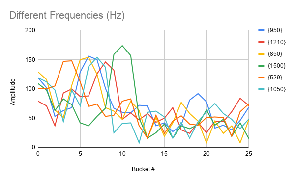

# Lab 2: Analog & Digital Circuitry and FFTs

## Overview
The goal of Lab 2 was to be able to detect a 950 Hz note using the FFT algorithm.
In order to do this, we designed an amplifying band pass circuit to take the output
of an electret microphone and boost the signal while blocking undesired frequencies.
This signal is then sent into the Arduino, where the FFT algorithm looks to find the right
frequency. At that point, our robot is to begin moving. In addition, we also designed a
Schmitt Trigger circuit to be used in our wall detection. We wire the output of an IR sensor
to the trigger, and it completely converts the analog signal into a digital one, thus freeing
up some analog ports for future use. In working on this lab, we broke up into two subteams:
Jinny and Ryan worked on the FFT algorithm and analysis, while Joy and Dan worked on designing
and building the circuitry for both the band pass amplifier and the Schmitt Trigger.

### Materials
* 1 Arduino Uno
* 1 USB A/B Cable
* Electret Microphone
* Multiple Capacitors (nF and uF range)
* Several Resistors (kΩ range)
* LM358P Operation Amplifiers
* Oscilloscope
* DC Power Supply
* Digital Multimeter
* Frequency Generator App for Cell Phone

## Amplifying Band Pass Circuit

The first part of this lab involved building a circuit for the electret microphone. A picture of a microphone along with a representative circuit schematic are shown below. The pull-up resistor is required to help bias the FET and power the microphone, while the capacitor blocks DC signals from the microphone.

<p align="center">
  
  
</p>

The first consideration when designing the circuit was to amplify the output of the microphone. The output voltage
was so small that nothing registered on the oscilloscope except when we would tap the microphone with our fingers.
Thus, we would need a very large gain, so we decided to design an inverting amplifier, carefully
selecting the resistors as to generate a huge gain. In addition to the huge gain, we also wanted to be able to
lower the gain of undesired frequencies; after all, the end goal is to detect a 950 Hz signal and other frequencies
could trigger false positives. Thus, we converted our inverting amplifier into a second order band pass filter. We
carefully selected the capacitor values (and modified the resistor values) so that the break frequencies were around
550 Hz and 1050 Hz. While the lower break frequency is a little low, we didn't have the components to make a working
filter that had a pass band that was so narrow. Our final circuit design is shown below.

<p align="center">
  
</p>

We then built the circuit on a breadboard and tested it by playing different frequencies using an app on a cell phone.
The results are shown in the video below.

<p align="center">
<iframe width="560" height="315" src="https://www.youtube.com/embed/1Nl6ceJsTIU" frameborder="0" allow="accelerometer; autoplay; encrypted-media; gyroscope; picture-in-picture" allowfullscreen></iframe>
</p>

## The FFT Algorithm
In order to correctly analyze the audio picked up by the microphone, we needed to use the Arduino FFT Library.
Modifying the sample code provided by the Arduino FFT Library's website, we were able to print through the serial
output, what the amplitude output values were for each of the bins of the FFT. The algorithm collects 512 values, 
recording 256 real and 256 imaginary values for the FFT. To see what the FFT bins collected, we print only half 
of the 256 values because the 2nd half (128 values) is a mirrored image of the first half.

```c

#define LOG_OUT 1 // use the log output function
#define FFT_N 256 // set to 256 point fft

#include <FFT.h> // include the library

void setup() {
  Serial.begin(9600); // use the serial port
  TIMSK0 = 0; // turn off timer0 for lower jitter
  ADCSRA = 0xe5; // set the adc to free running mode
  ADMUX = 0x40; // use adc0
  DIDR0 = 0x01; // turn off the digital input for adc0
}

void loop() {
  while (1) { // reduces jitter
    cli();  // UDRE interrupt slows this way down on arduino1.0
    for (int i = 0 ; i < 512 ; i += 2) { // save 256 samples
      while (!(ADCSRA & 0x10)); // wait for adc to be ready
      ADCSRA = 0xf5; // restart adc
      byte m = ADCL; // fetch adc data
      byte j = ADCH;
      int k = (j << 8) | m; // form into an int
      k -= 0x0200; // form into a signed int
      k <<= 6; // form into a 16b signed int
      fft_input[i] = k; // put real data into even bins
      fft_input[i + 1] = 0; // set odd bins to 0
    }
    fft_window(); // window the data for better frequency response
    fft_reorder(); // reorder the data before doing the fft
    fft_run(); // process the data in the fft
    fft_mag_log(); // take the output of the fft
    sei();
    Serial.println("\nStart: ");
    for (byte i = 0 ; i < FFT_N/2; i++) {
      Serial.println(fft_log_out[i]); // send out the data
    }
  }
}
```
To analyze the tone that was played, we copy and paste the values printed onto the output to a spreadsheet for
graphical analysis. The following graphs show the consistency of the pitch recordings for the 950 Hz tone and 
the differences between pitches. 




The graphs show a subset of the 128 bins for clarity. We noticed that there was a certain pattern to the 
950 Hz tone that was seen in the 850 Hz or the 1050 Hz. These subtle differences helped guide the creation
of the algorithm for detecting the 950 Hz tone. The following code snippet shows the modifications to the code
above that allowed for the detection of the 950 Hz tone.

```c
...

int is_maximum( int five, int six, int seven, int eight, int FFT_threshold ) {
  if ( six > FFT_threshold && seven > FFT_threshold ) {
    if ( six > five && six > eight && seven > five && seven > eight ) {
      // checking that six and seven are a local maximum
      if ( six - seven < 10 && six - five > 10 && six - seven > 0) {
        // checking that shape of curve is correct
        return 1;
      }
    }
  }
  else {
    return 0;
  }
}
...

void loop() {
  while(1) { //reduces jitter

    ...
    
    int max = is_maximum( fft_log_out[5], fft_log_out[6], fft_log_out[7], fft_log_out[8], 100 );
    if ( max == 1 && detect_count >= 90) {
      Serial.println("950 Hz");
      detect_count = 0;
    }
    else if ( max == 1 ) {
      detect_count++;
    }
  }
}
```

The following video shows that the 950 Hz frequency is able to be correctly detected. One video shows what happens
when a 950 Hz tone is played, and the other shows what happens when an 850 Hz tone is played.

<p align="center"><iframe width="560" height="315" src="https://www.youtube.com/embed/HY07C-CH3QI" frameborder="0" allow="accelerometer; autoplay; encrypted-media; gyroscope; picture-in-picture" allowfullscreen></iframe></p>

<p align="center"><iframe width="560" height="315" src="https://www.youtube.com/embed/xcg0s0v5csI" frameborder="0" allow="accelerometer; autoplay; encrypted-media; gyroscope; picture-in-picture" allowfullscreen></iframe>
</p>

## Implementing Schmitt Trigger

For our other circuit, we decided to design a Schmitt Trigger that would be used in detecting walls.
We had very little experience with Schmitt Triggers so we used <a href="https://howtomechatronics.com/how-it-works/electrical-engineering/schmitt-trigger/">this website</a> as a reference. Our final circuit design is shown below, along with a
schematic explaining how it works. We designed the circuit so that it outputs either 0V or 5V. When the output is 0V,
the voltage divider on the left is used to determine the threshold voltage, while the voltage divider on the right is used when the output is 5V. Because of its intended use, we made the high to low threshold 600 mV and the low to high threshold
400 mV. These values were determined by experimenting with the voltage level that the IR sensors output when they detect an
object.

<p align="center">
  
  
</p>

Two videos are shown below. The first video displays the behavior of the circuit when sweeping a DC input. The second
video displays the behaviour of the circuit when it takes in the output of the IR sensor.

<p align="center"><iframe width="560" height="315" src="https://www.youtube.com/embed/KV99awF2qbQ" frameborder="0" allow="accelerometer; autoplay; encrypted-media; gyroscope; picture-in-picture" allowfullscreen></iframe></p>

<p align="center"><iframe width="560" height="315" src="https://www.youtube.com/embed/hOAEnnWUPrM" frameborder="0" allow="accelerometer; autoplay; encrypted-media; gyroscope; picture-in-picture" allowfullscreen></iframe></p>

<p align="center">
<iframe width="560" height="315" src="https://www.youtube.com/embed/ERu0vwRGqaw" frameborder="0" allow="accelerometer; autoplay; encrypted-media; gyroscope; picture-in-picture" allowfullscreen></iframe>
</p>

## Conclusion
This lab was challenging as it involved combining knowledge of circuits and signals to properly build a filter for
the microphone that would enable an easier analysis of the FFT signals. In addition, the challenge of building the
Schmitt Trigger and making sure it functioned properly also took some effort. Overall, it was a meaningful lab
that will ultimately steer us towards our ultimate goal.  
